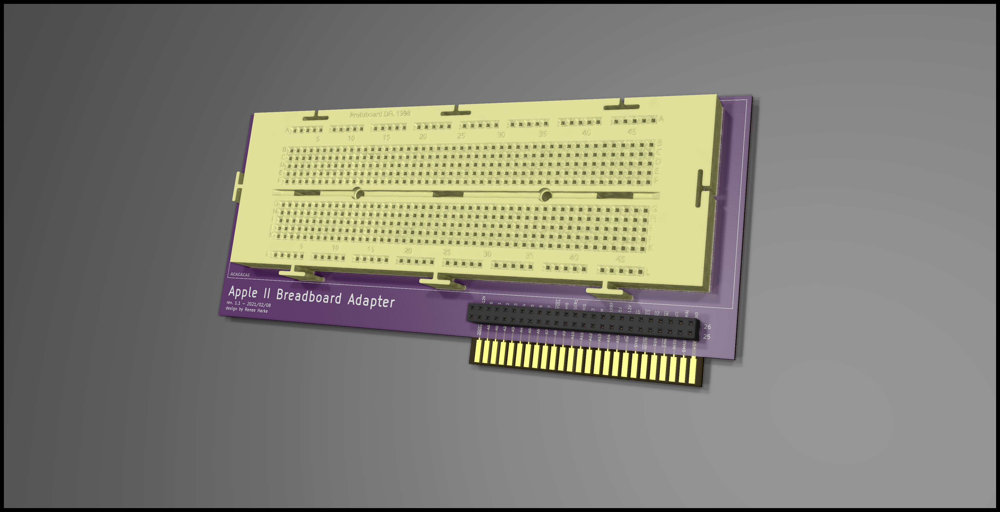

# Apple II Breadboard Card

This is just that plugs into the Apple II bus, has a spot to mount a 50-pin socket to break out all of the power and bus signals, and gives space to mount a standard 830 point solderless breadboard.

## Render

### Breadboard Model Attribute
Render image with breadboard generated using model from [Paco Martinez on Grabcad](https://grabcad.com/library/breadboard-8)